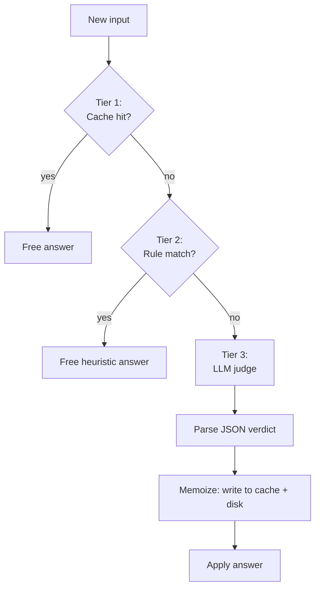
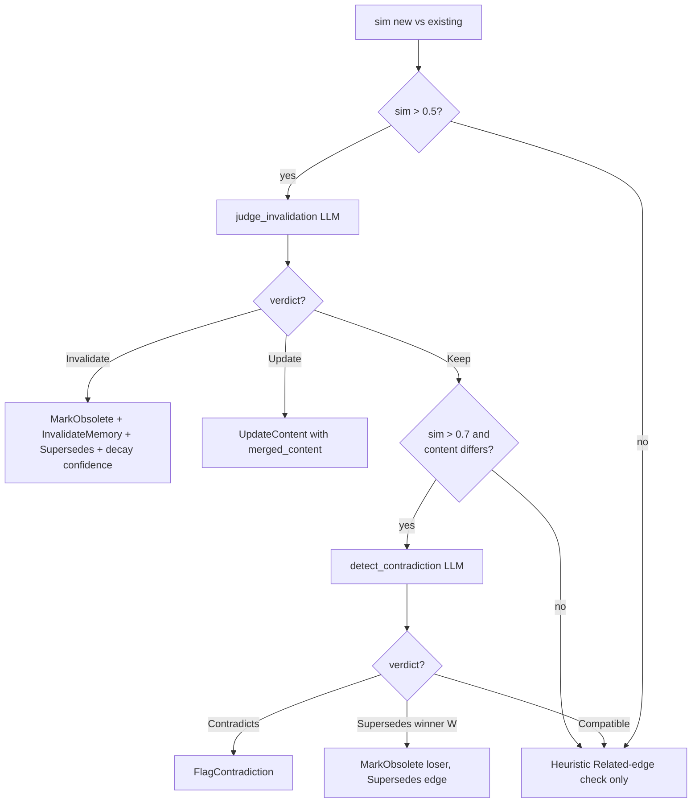
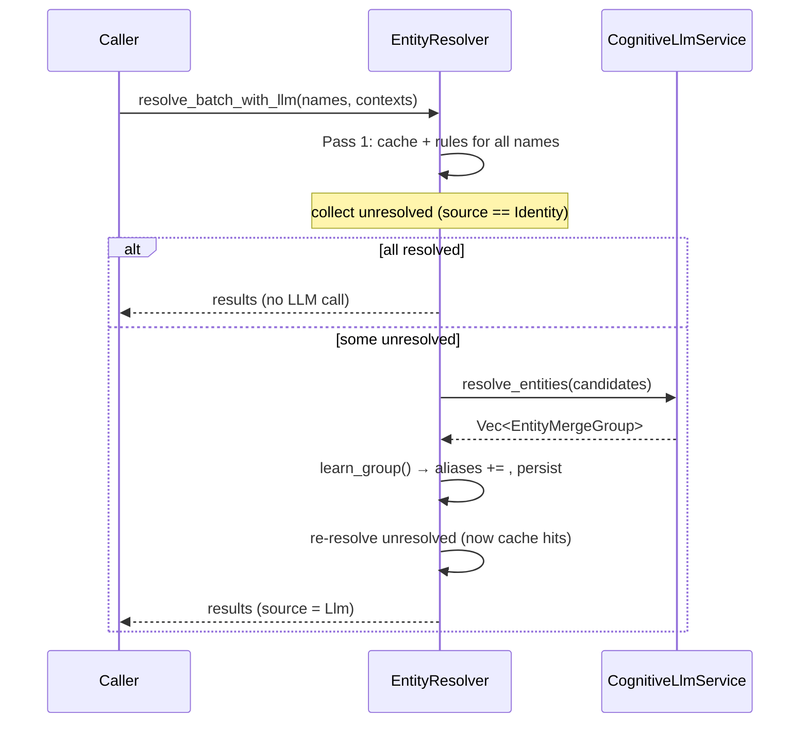
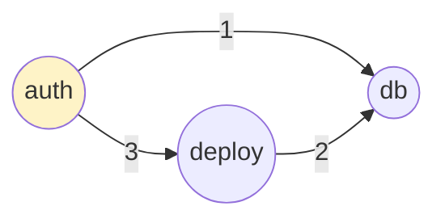
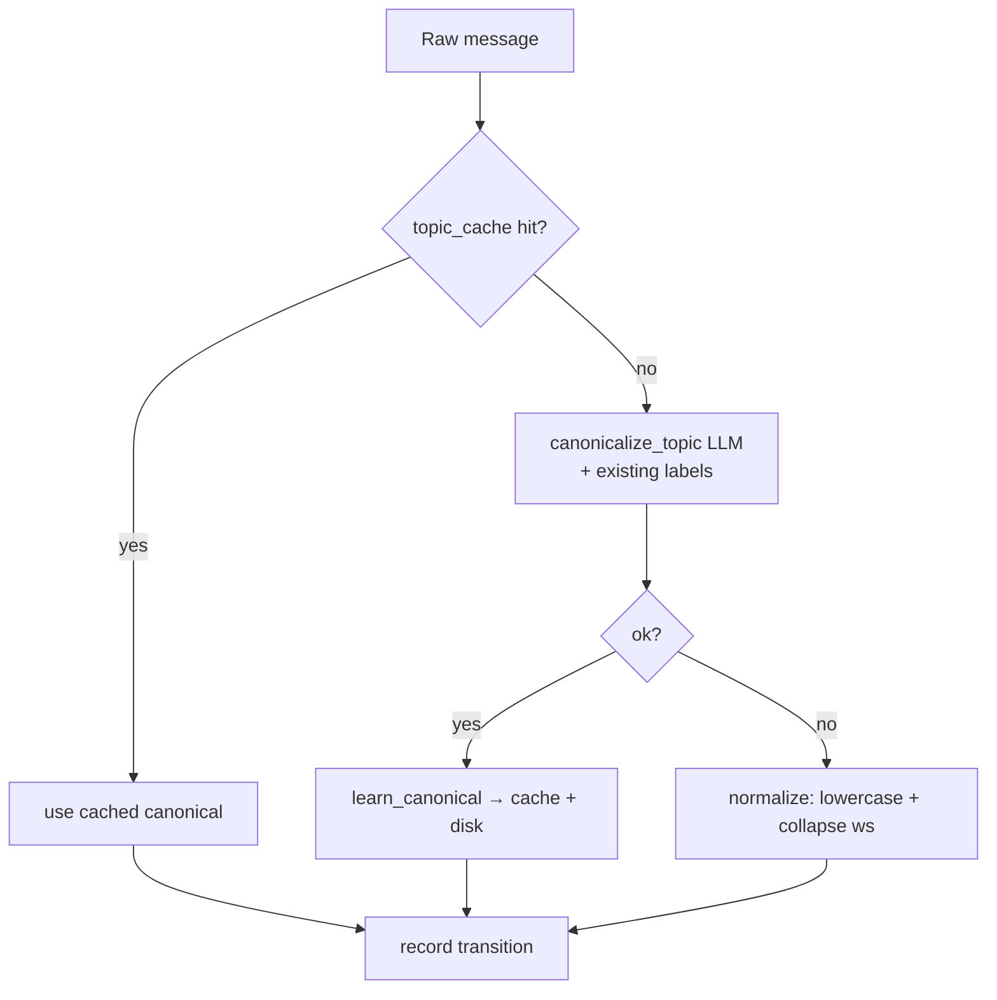
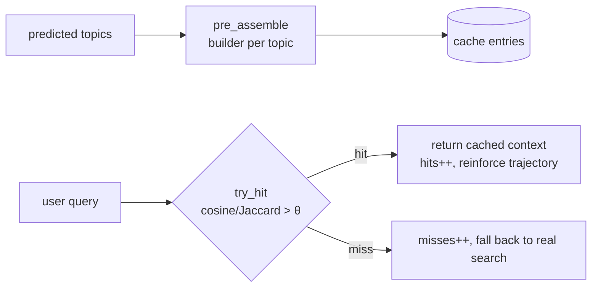
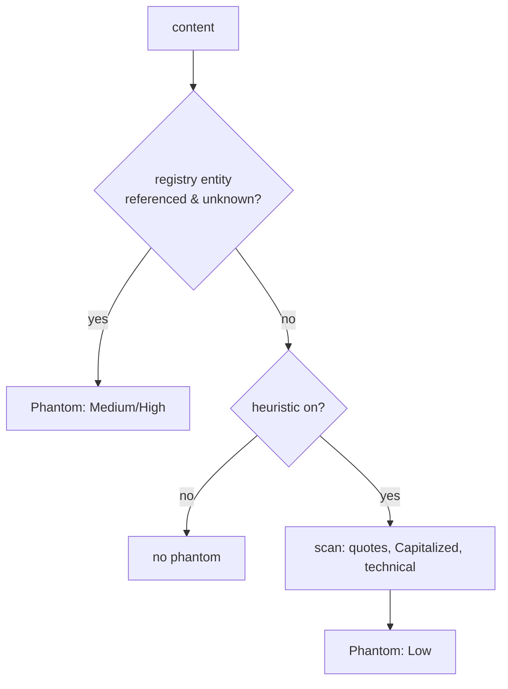
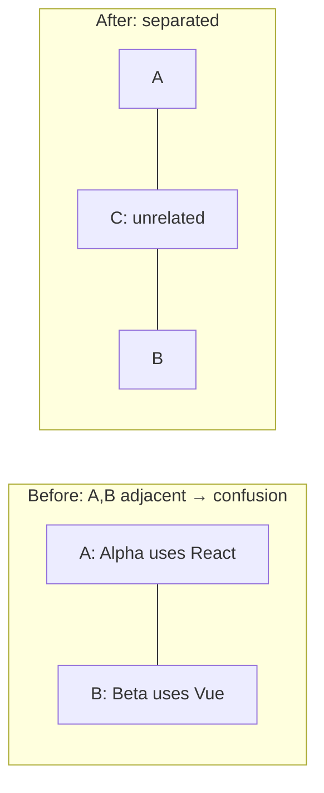
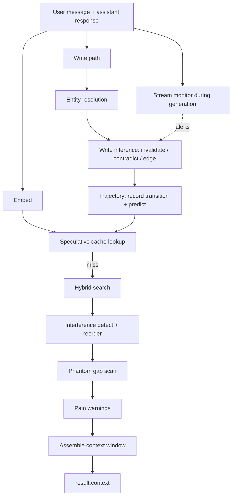

# MenteDB Cognitive Modules — Logic, Maths & Diagrams

A code-accurate reference for every module in `crates/mentedb-cognitive/`. For
each: what it computes, the data structures, the algorithm as pseudocode, a
diagram, and the underlying maths with a worked example.

> Line references are to `crates/mentedb-cognitive/src/`.

---

## Table of contents
1. [Shared mathematics](#1-shared-mathematics)
2. [Write-time inference](#2-write-time-inference--write_inferencers)
3. [The LLM judge layer](#3-the-llm-judge-layer--llmrs)
4. [Entity resolution](#4-entity-resolution--entityrs)
5. [Trajectory tracking (Markov)](#5-trajectory-tracking--trajectoryrs)
6. [Speculative context cache](#6-speculative-context-cache--speculativers)
7. [Phantom memory detection](#7-phantom-memory-detection--phantomrs)
8. [Pain signals](#8-pain-signals--painrs)
9. [Interference detection](#9-interference-detection--interferencers)
10. [Stream monitoring](#10-stream-monitoring--streamrs)
11. [How they compose](#11-how-they-compose)

---

## 1. Shared mathematics

Three formulas recur across the crate. We define them once here.

### 1.1 Cosine similarity
The similarity between two embedding vectors **a**, **b** ∈ ℝᵈ:

```
            a · b              Σᵢ aᵢ bᵢ
sim(a,b) = ―――――――― = ――――――――――――――――――――――――――――――
           ‖a‖·‖b‖   √(Σᵢ aᵢ²) · √(Σᵢ bᵢ²)
```

Range −1…1; for normalized embeddings effectively 0…1. Used by
`write_inference`, `interference`, and `speculative`. Implemented identically in
each (e.g. write_inference.rs:49, interference.rs:16, speculative.rs:33).

**Worked example** — `a = [1, 0, 0]`, `b = [0.99, 0.1, 0]`:
```
dot  = 0.99
‖a‖  = 1
‖b‖  = √(0.9801 + 0.01) = √0.9901 ≈ 0.9950
sim  = 0.99 / 0.9950 ≈ 0.995      ← same agent, different content → contradiction
```

### 1.2 The three-tier cost model
Every "smart" feature is wrapped in the same fallback ladder:



Memoization is the trick that keeps token cost bounded: the LLM is paid **once
per novel pattern**, then never again.

### 1.3 Exponential decay (used by pain, and conceptually by trajectory)
```
I(t) = I₀ · e^(−λ·Δt)        where Δt = t_now − t_created
```
Half-life: `t½ = ln(2) / λ`. With `λ = 0.0001` per µs and `Δt = 10000` µs,
`I = e⁻¹ ≈ 0.368`.

---

## 2. Write-time inference  — `write_inference.rs`

**Purpose.** On every memory write, compare the new memory against existing ones
and emit typed `InferredAction`s: flag contradictions, mark old memories
obsolete, set temporal validity windows, create graph edges, decay confidence.

**Config (`WriteInferenceConfig::default`, write_inference.rs:84):**

| Threshold | Value | Meaning |
|---|---|---|
| `contradiction_threshold` | 0.95 | sim above this + diff content → contradiction |
| `obsolete_threshold` | 0.85 | newer memory obsoletes older |
| `related_min` / `related_max` | 0.60 / 0.85 | sim in this band → `Related` edge |
| `correction_threshold` | 0.50 | for `Correction`-type memories |
| `confidence_decay_factor` | 0.50 | multiplier on superseded memory's confidence |
| `confidence_floor` | 0.10 | confidence never drops below this |

### 2.1 Heuristic path — `infer_on_write` (no LLM)

```
for each existing memory e (≠ new):
    s = sim(new, e)
    if s > 0.95 and e.agent == new.agent and e.content != new.content:
        emit FlagContradiction(new, e)
    if s > 0.85 and new.created_at > e.created_at:
        emit MarkObsolete(e ← new)
        emit InvalidateMemory(e, valid_until = new.created_at)
    if 0.60 < s ≤ 0.85:
        emit CreateEdge(new → e, Related, weight = s)

if new.type == Correction:
    original = argmax_e sim(new, e)
    if sim(new, original) > 0.50:
        emit CreateEdge(new → original, Supersedes, 1.0)
        emit UpdateConfidence(original, max(orig·0.5, 0.1))
```

### 2.2 LLM path — `infer_on_write_with_llm`

The LLM is **gated by similarity** to control cost — it is only consulted when
`sim > 0.5`, and the contradiction sub-check only when `sim > 0.7`:



### 2.3 The maths of confidence decay
When a `Correction` supersedes an original memory:
```
confidence_new = max(confidence_old × confidence_decay_factor, confidence_floor)
               = max(confidence_old × 0.5, 0.1)
```
Each supersession halves confidence until it floors at 0.1 — a geometric decay:
after *k* supersessions, `confidence ≈ max(0.1, 0.9 · 0.5ᵏ)`.

---

## 3. The LLM judge layer — `llm.rs`

**Purpose.** One typed service, `CognitiveLlmService<J: LlmJudge>`, that wraps
any chat-completion backend and exposes seven judgment calls. Everything else
delegates to this.

### 3.1 The seven judgments

| Method | Prompt (`llm.rs:171–273`) | Output enum |
|---|---|---|
| `judge_invalidation` | `INVALIDATION_SYSTEM` | `Keep \| Invalidate \| Update{merged}` |
| `detect_contradiction` | `CONTRADICTION_SYSTEM` | `Compatible \| Contradicts \| Supersedes{winner}` |
| `resolve_entities` | `ENTITY_RESOLUTION_SYSTEM` | `Vec<EntityMergeGroup>` |
| `consolidate` | `CONSOLIDATION_SYSTEM` | `KeepAll \| Merge \| Deduplicate` |
| `canonicalize_topic` | `TOPIC_SYSTEM` | `TopicLabel{topic, is_new}` |
| `generate_community_summary` | `COMMUNITY_SUMMARY_SYSTEM` | `CommunitySummary` |
| `generate_user_profile` | `USER_PROFILE_SYSTEM` | `UserProfile` |

Each prompt enforces **JSON-only output** with few-shot examples. Verdicts are
`#[serde(tag = "verdict", rename_all = "snake_case")]` enums, so the engine
pattern-matches exhaustively.

### 3.2 Response parsing — `parse_json_response` (llm.rs:489)
LLMs wrap JSON unpredictably. The parser is a 4-stage cascade:

```mermaid
flowchart LR
    R[Raw response] --> D1[Direct serde_json::from_str]
    D1 -- err --> ST[Strip ```json fences]
    ST --> D2[Parse stripped]
    D2 -- err --> FB[find first '{' + balanced-brace scan]
    FB --> D3[Parse substring]
    D3 -- err --> ERR[ParseError]
```

The balanced-brace scanner (`rfind_matching_brace`, llm.rs:535) tracks string
state and `\` escapes so braces nested inside JSON string *values* don't fool it.

### 3.3 The key distinction the prompts encode
Most memory tools conflate two different relationships. MenteDB separates them:

- **`Contradicts`** — logical conflict, both cannot be true: *"prefers tabs"* vs
  *"prefers spaces"*.
- **`Supersedes`** — temporal replacement, the old one *was* true: *"uses
  React"* vs *"migrated to Vue"*. Supersedes carries `superseding_id` (the
  winner), which drives `MarkObsolete + InvalidateMemory(valid_until=…)`.

This split is what lets the engine keep history (valid_until interval) instead
of deleting, so temporal queries can still resolve past states.

---

## 4. Entity resolution — `entity.rs`

**Purpose.** Map many surface references ("Alice", "my manager", "Alice Smith")
to one canonical entity. Three tiers, with a negative cache.

### 4.1 Data structures
```
aliases:      HashMap<normalized_alias → canonical>
confidence:   HashMap<normalized_alias → f32>
negative_pairs: HashSet<(a, b)>   # confirmed DIFFERENT, sorted tuple
```
Persisted atomically to JSON (`Snapshot` v2, entity.rs:271).

### 4.2 Tier 2 — the word-subset rule (entity.rs:207)
Split on whitespace / `-` / `_` into word sets, then test subset:

```
match iff  words(input) ⊆ words(canonical)  OR  words(canonical) ⊆ words(input)
```

**Why this is better than substring:** substring would match `"java"` ⊂
`"javascript"` (wrong). Word-set subset does **not**, because `{"java"}` ⊄
`{"javascript"}`. Returns confidence `0.7`.

| Input | Canonical | Word-subset? | Result |
|---|---|---|---|
| `"Alice"` | `"alice smith"` | `{alice}` ⊆ `{alice, smith}` ✓ | match 0.7 |
| `"Java"` | `"javascript"` | `{java}` ⊄ `{javascript}` ✗ | no match |
| `"gpt 4"` | `"gpt-4"` | `{gpt, 4}` = `{gpt, 4}` ✓ | match |

### 4.3 Tier 3 — LLM resolution flow



The learned aliases mean the **next** conversation pays nothing — the LLM is
billed once per distinct aliasing pattern, ever.

---

## 5. Trajectory tracking — `trajectory.rs`

**Purpose.** Learn the conversation's topic flow and predict the next topic, so
the speculative cache can pre-assemble context before the user asks.

### 5.1 The model — a first-order Markov chain

A Markov chain models a sequence where the next state depends only on the
current state (the *Markov property*):

```
P(Xₜ₊₁ | Xₜ, Xₜ₋₁, …, X₀) = P(Xₜ₊₁ | Xₜ)
```

`TransitionMap` estimates the transition probabilities by **frequency counting**
(maximum-likelihood estimate):

```
                         count[from][to]
P(to | from)  ≈   ―――――――――――――――――――――――――――
                    Σⱼ count[from][j]
```

Data structure (trajectory.rs:47):
```
transitions: HashMap<from_topic, HashMap<to_topic, count>>
topic_cache: HashMap<raw_topic → canonical_label>
```

### 5.2 Operations as maths

| Operation | Code | Effect on the transition counts |
|---|---|---|
| `record(from, to)` | :67 | `count[from][to] += 1` |
| `reinforce(from, to)` | :78 | `count[from][to] += 2` (bonus on a cache hit) |
| `decay(from, to)` | :89 | `count[from][to] −= 1` (saturating; drop if 0) |
| `predict_from(t, n)` | :107 | top-n `to` by count = argmax of P(to\|t) |

### 5.3 Worked example
Counts after a session: `auth→deploy: 3`, `auth→db: 1`, `deploy→db: 2`.

```
P(deploy | auth) = 3 / (3+1) = 0.75
P(db     | auth) = 1 / (3+1) = 0.25
P(db | deploy)   = 2 / 2     = 1.00
```
`predict_from("auth", 2)` → `[("deploy", 3), ("db", 1)]`.



### 5.4 Topic canonicalization (the LLM tier)
Raw user messages vary ("deploy to staging", "ship to prod"). Before recording a
transition, the topic is canonicalized through its own 3-tier ladder:



### 5.5 Bounded growth
- Trajectory itself is a ring buffer (`max_turns`, default 100, trajectory.rs:261).
- `save(path, min_count)` **prunes** any transition with `count < min_count`, so
  the persisted model only keeps statistically real patterns.
- `load` **merges** counts (doesn't overwrite), so patterns accumulate across
  sessions.

### 5.6 Honest modelling note
This is a *first-order* chain — it cannot model `auth → deploy → db` as a
sequence dependency, only pairwise. Higher-order chains or sequence models would
fit more pattern but need more data than an agent typically produces per topic
pair. First-order is the right bias/variance trade-off here.

---

## 6. Speculative context cache — `speculative.rs`

**Purpose.** When the trajectory predicts upcoming topics, pre-build their
context windows so the next query is a cache hit (skipping search + assembly).

### 6.1 Score function
For a query `q` against a cached entry with topic `t`:
```
score(q, t) = cosine(q_emb, t_emb)        if both embeddings present
            = Jaccard(words(q), words(t)) otherwise
```
**Jaccard:**
```
            | words(q) ∩ words(t) |
J(A, B) = ―――――――――――――――――――――――――
            | words(q) ∪ words(t) |
```
Threshold is adaptive: `embedding_threshold` (0.40) when embeddings used, else
`keyword_threshold` (0.50) — speculative.rs:145.

### 6.2 Eviction & persistence
- **LRU** — `evict_lru` removes `argmin(last_accessed)` when full (speculative.rs:178).
- **Stale sweep** — `evict_stale(max_age, now)` drops entries older than `max_age`.
- **Persistence** — `save(path, min_hits)` keeps only entries with
  `hit_count ≥ min_hits`; `load` merges and resets `last_accessed`.

### 6.3 Stats counters
```
hits / misses / evictions / cache_size
```
The hit-rate feeds back into trajectory reinforcement (a hit → `+2` bonus).



---

## 7. Phantom memory detection — `phantom.rs`

**Purpose.** Detect when the conversation references an entity the agent has no
stored knowledge about — a knowledge gap. Two strategies.

### 7.1 Strategy A — Registry (precise)
An explicit `EntityRegistry: AHashSet<String>`. Any referenced entity *not in
the registry* is flagged. Priority:
```
multi-word referenced entity → High
single-word referenced entity → Medium
```
This is exact-set-membership — zero false positives.

### 7.2 Strategy B — Heuristic (fallback, default on)
When no registry match, scan for:
- **Quoted terms** — text inside `'…'` / `"…"` / curly quotes.
- **Capitalized sequences** — consecutive Capitalized words
  ("Kubernetes Cluster", "JWT Token").
- **Technical tokens** — contain `-`, `.`, `_`, or are ALL_CAPS/digits.

Flagged as **Low** priority. Disable with `PhantomConfig::use_heuristic_detection = false`.



Priority ordering on output: `Critical > High > Medium > Low` (get_active_phantoms, phantom.rs:348).

---

## 8. Pain signals — `pain.rs`

**Purpose.** Remember negative experiences (failed actions, corrections) and
surface warnings when the current context touches the same area.

### 8.1 Signal shape
```
PainSignal {
    intensity:        f32,        # 0..1, how bad it was
    trigger_keywords: Vec<String>,# what context activates it
    decay_rate:       f32,        # λ in the decay formula
    created_at:       Timestamp,
}
```

### 8.2 The maths

**Decay** — exponential, computed lazily (pain.rs:78):
```
I(t) = I₀ · e^(−λ · (t − t_created))
```
Half-life `t½ = ln(2)/λ`. A signal with `λ = 1e-4` and `Δt = 10000` has
`I = e⁻¹ ≈ 0.368`.

**Context relevance** — fraction of the signal's triggers present in context:
```
relevance = |triggers ∩ context_keywords| / |triggers|
```

**Ranking score:**
```
score = intensity × relevance
```
Signals are sorted by score descending; top `max_warnings` (default 5) are
returned and formatted as `"CAUTION: … (pain: 0.95). Triggers: […]"`.

### 8.3 Weakness
Trigger matching is **substring + lowercase** (pain.rs:50), not semantic. A
trigger of `"mongodb"` activates on any context keyword containing that
substring, and paraphrases won't fire. Cheap, but brittle recall.

---

## 9. Interference detection — `interference.rs`

**Purpose.** Find pairs of memories so similar they'd confuse the LLM, emit a
disambiguation note, and reorder the context so they aren't adjacent.

### 9.1 Detection — pairwise cosine
```
for i < j in context:
    s = sim(mem[i], mem[j])
    if s > θ (default 0.8) and mem[i].content != mem[j].content:
        record InterferencePair(i, j, s, disambiguation)
```
Cost: **O(n²)** for a context window of size n — fine for small windows, the
main scaling concern in the crate.

### 9.2 Reordering — greedy separation (interference.rs:65)
Given a conflict set, produce an ordering where no conflicting pair is adjacent:

```
result = []
remaining = queue(memories)
while remaining not empty:
    first = remaining.pop_front()
    if result empty or last(result) doesn't conflict with first:
        result.push(first)
    else:
        scan remaining for any non-conflicting item; push it, requeue first
        if none found: push first anyway
```



This is a heuristic for the **Hamiltonian-path-with-separation** problem — not
optimal, but O(n) after the pairs are known.

---

## 10. Stream monitoring — `stream.rs`

**Purpose.** Watch the LLM's output token stream and fire alerts when generated
text seems to contradict, forget, correct, or reinforce a stored fact — in real
time, without an LLM judge per token.

### 10.1 The ring buffer
A `VecDeque<String>` of size `buffer_size` (default 1000). When full, the oldest
token is drained into `accumulated` before eviction (stream.rs:86), so the full
text is recoverable via `drain_buffer()`.

### 10.2 Alert maths
For each stored fact, let `K = {words of length ≥ 3 in fact}`:
```
matched = |{ k ∈ K : k ⊆ generated_text_lower }|
ratio   = matched / |K|
```
Then:
```
if ratio > 0.5 and generated ≠ fact and has_negation(generated):  → Contradiction
else if ratio > 0.8:                                             → Reinforcement
```
`has_negation` is a **keyword test** (stream.rs:128) for `"not "`, `"never "`,
`"don't "`, `"doesn't "`, `"isn't "`, `"actually "`, `"instead "`.

### 10.3 Honest weakness
Keyword-ratio + negation-keyword is the crudest cognition signal in the crate.
It false-positives on `"I could not be happier"` and false-negatives on
`"switched away from"`. It exists because **you cannot run an LLM judge per
generated token** — it's a cheap streaming guard, not ground truth. Treat its
alerts as hints to be confirmed by the write-time LLM path after the turn.

---

## 11. How they compose

Each module is independent and testable in isolation. The orchestration that
chains them into the `process_turn` pipeline lives in the `mentedb` facade crate
(and the README's "14-step cognitive pipeline"). Conceptually:



The read path (top) builds the context the LLM sees; the write path (bottom)
updates memory and *learns* so future read paths are better. The feedback loops
(trajectory → speculative cache → cache-hit reinforces trajectory) are what make
the system improve with use.

---

### Cross-cutting cheat sheet

| Module | Core maths | LLM? | Cost class |
|---|---|---|---|
| Write inference | cosine thresholds + confidence decay | optional | O(n) per write |
| LLM judge | (delegated to model) | yes | gated by sim > 0.5 |
| Entity resolution | word-set subset; alias memoization | optional | O(1) cache hit |
| Trajectory | first-order Markov MLE | optional | O(1) record, O(k log k) predict |
| Speculative cache | cosine / Jaccard + LRU | no | O(n) lookup |
| Phantom | set membership + regex heuristics | no | O(words) |
| Pain | exponential decay + relevance ratio | no | O(signals × triggers) |
| Interference | cosine, O(n²) + greedy separation | no | O(n²) |
| Stream | keyword-overlap ratio + negation keys | no | O(facts × keywords) |
