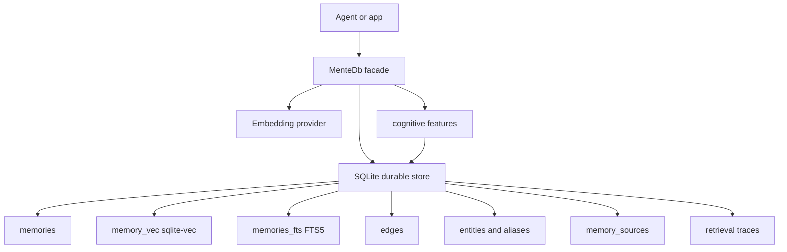

# MenteDB

> Beta. This fork is under active development for Synapse style AI memory. APIs,
> schemas, and crate boundaries may change while the memory layer is hardened.

[](LICENSE)

MenteDB is a Rust memory engine for AI agents. This branch is a SQLite backed
evolution of the original project: durable memory rows live in SQLite, vector
search is handled by `sqlite-vec`, keyword search uses FTS5, graph and entity
links are inspectable SQL rows, and retrieval can be traced for debugging.

The product goal is a memory layer that is useful in real agent systems: easy to
inspect, easy to rebuild, traceable when recall fails, and flexible enough to add
LLM extraction, relationship graphs, rerankers, and future search experiments.

## Current Direction

The original MenteDB implementation included a custom page store, WAL, HNSW
index, and CSR/CSC graph persistence. This fork moves the durable storage path
to SQLite because maintaining a database engine and a memory product at the
same time is not the right tradeoff for Synapse.

Current durable model:

- `memories` is the canonical source of truth for memory content, metadata,
  embeddings, temporal validity, salience, and confidence.
- `memory_vec` is a `sqlite-vec` projection for vector search.
- `memories_fts` is an FTS5 projection for keyword search.
- `edges` stores graph relationships as normal inspectable rows.
- `memory_sources` records provenance such as conversation id, turn id, actor,
  extractor, prompt hash, and payload.
- `entities`, `entity_aliases`, and `memory_entities` store explicit entity
  links and aliases.
- `retrieval_traces` and `retrieval_trace_hits` explain what recall searched,
  scored, and returned.
- `memory_operations` records append-only write operations for audit and debug.

See [docs/SQLITE_MEMORY_SCHEMA.md](docs/SQLITE_MEMORY_SCHEMA.md) for the schema
and rationale.

## What Works Now

- SQLite backed persistence through `crates/mentedb-sqlite`.
- `sqlite-vec` vector search with deferred dimension setup and rebuild support.
- FTS5 keyword search and reciprocal rank fusion hybrid recall.
- Graph edge persistence and recursive SQL traversal.
- Memory source and provenance records.
- Retrieval tracing for debugging recall.
- Deterministic surface entity linking for explicit tags and structured fields.
- Entity-aware recall boost using stored aliases and memory links.
- Cognitive facade APIs through `MenteDb`.
- REST and gRPC server crates remain in the workspace.
- Python and TypeScript SDK folders remain present, although they may need
  follow-up updates before publishing from this fork.

## Important Scope Notes

This fork is not yet the final production memory layer.

Implemented now:

- durable SQLite storage
- vector and FTS search projections
- graph rows
- provenance rows
- retrieval trace rows
- explicit surface entity linking
- entity-aware recall boost

Still planned:

- async LLM extraction pipeline for entities, claims, relationships, and
  corrections
- first-class claim and entity relationship tables
- evidence spans and extraction version tracking
- richer graph expansion during retrieval
- reranking experiments
- debug and inspection UI or CLI views
- lifecycle policies for deduplication, correction, decay, archival, and forget
- production packaging under a new repository identity

The key invariant is that raw episodes and source memories remain the durable
truth. LLM outputs should be derived, versioned, evidence-backed, and rebuildable.

## Quick Start

Build and test:

```bash
cargo build --workspace
cargo test --workspace
cargo clippy --workspace -- -D warnings
```

Open a local database from Rust:

```rust
use std::path::Path;

use mentedb::MenteDb;
use mentedb_core::{memory::MemoryType, types::AgentId, MemoryNode};

fn main() -> anyhow::Result<()> {
    let db = MenteDb::open(Path::new("./agent-memory"))?;
    let node = MemoryNode::new(
        AgentId::nil(),
        MemoryType::Semantic,
        "Name: Pratap. Project Synapse uses Flutter and SQLite.".to_string(),
        vec![0.1, 0.2, 0.3, 0.4],
    );
    let id = node.id;

    db.store(node)?;
    println!("stored {id}");
    Ok(())
}
```

Run the memory drift benchmark with local Ollama embeddings:

```bash
cargo run -p mentedb --example pratap_memory_drift -- \
  --turn-mode mimic-flutter \
  --embedding-provider ollama \
  --embedding-model nomic-embed-text:latest \
  --trace-retrieval \
  --db-dir /Volumes/Fatboi/mentedb-grasp/benchmarks/test_db_entity_trace_v4 \
  --output /Volumes/Fatboi/mentedb-grasp/benchmarks/results/pratap_memory_drift-ollama-nomic-entity-trace-v4.jsonl
```

Recent local result with `nomic-embed-text:latest`:

```text
Result: 8/8 context pass rate, 100.0%
```

## Debugging Memory

SQLite is intentionally part of the product strategy. During development you
should be able to inspect the memory layer with ordinary SQL.

Useful tables:

| Table | Purpose |
|-------|---------|
| `memories` | canonical memory content and metadata |
| `memory_sources` | provenance, conversation id, turn id, extractor metadata |
| `memory_tags` | indexable memory tags |
| `edges` | memory graph relationships |
| `entities` | canonical entity records |
| `entity_aliases` | alias lookup for entity recall |
| `memory_entities` | memory to entity evidence links |
| `retrieval_traces` | one row per traced recall |
| `retrieval_trace_hits` | per-result scoring details |
| `memory_operations` | append-only write audit |

Example inspection queries:

```sql
SELECT id, memory_type, content, created_at
FROM memories
ORDER BY created_at DESC
LIMIT 20;

SELECT e.entity_type, e.canonical, a.alias
FROM entities e
JOIN entity_aliases a ON a.entity_id = e.entity_id
ORDER BY e.updated_at DESC;

SELECT trace_id, query_text, requested_k, created_at
FROM retrieval_traces
ORDER BY created_at DESC
LIMIT 10;

SELECT rank_position, memory_id, score, source
FROM retrieval_trace_hits
WHERE trace_id = ?
ORDER BY rank_position ASC;
```

## Architecture



Recall is currently a blend of:

1. vector candidates from `sqlite-vec`
2. keyword candidates from FTS5
3. reciprocal rank fusion
4. tag and time filters
5. entity alias candidates as an additive recall signal
6. optional retrieval trace persistence

## Crates

| Crate | Role |
|-------|------|
| `mentedb` | main facade and orchestration |
| `mentedb-sqlite` | SQLite, sqlite-vec, FTS5, graph rows, provenance, trace tables |
| `mentedb-core` | core types, ids, errors, memory and edge models |
| `mentedb-cognitive` | write inference, entity resolution, pain, phantom, speculative features |
| `mentedb-consolidation` | decay, compression, consolidation, archival, forget helpers |
| `mentedb-context` | context assembly, U curve layout, delta tracking |
| `mentedb-embedding` | embedding provider abstraction and providers |
| `mentedb-extraction` | LLM extraction support, still evolving |
| `mentedb-graph` | in-memory graph algorithms used by cognitive features |
| `mentedb-index` | legacy and algorithmic index structures still present in workspace |
| `mentedb-query` | MQL parser and planner |
| `mentedb-server` | REST and gRPC server |
| `mentedb-storage` | compatibility storage crate, currently simplified after SQLite move |
| `mentedb-replication` | experimental Raft replication layer |

## Configuration

Most cognitive features are configured through `CognitiveConfig`.

Entity surface linking is controlled by `EntityExtractionConfig`:

```rust
use std::path::Path;

use mentedb::{CognitiveConfig, EntityExtractionConfig, MenteDb};

let config = CognitiveConfig {
    entity_extraction_config: EntityExtractionConfig {
        enabled: true,
        recall_enabled: true,
        recall_boost: 1.0,
        ..Default::default()
    },
    ..Default::default()
};

let db = MenteDb::open_with_config(Path::new("./memory"), config)?;
```

The current deterministic linker only links explicit surfaces such as:

- `entity:synapse` tags
- `entity_type:project` tags
- `Name: Pratap`
- `Project Synapse is ...`
- `Location: Sydney, Australia`
- `Core stack: Flutter, Dart, SQLite`

Semantic extraction from natural language should be handled by the planned LLM
extractor, not by expanding hot-path heuristics.

## Server

The server crate remains available:

```bash
cargo run -p mentedb-server -- --data-dir ./data
```

Security features in the server include JWT auth, admin token issuance, agent
checks, rate limiting, REST endpoints, and gRPC tests. Recheck deployment
configuration before exposing this fork in production.

## Repository Status

This repository is currently being adapted for Synapse style memory work. Before
publishing packages or using this as a public product, update:

- repository URLs
- package names if the product is renamed
- README badges
- crate descriptions
- CI release targets
- SDK package metadata
- Docker image names
- benchmark artifacts committed from older branch work

## Attribution

This project is derived from the original MenteDB project by Nam Rodriguez.

Original project metadata in the upstream code identified:

- Author: Nam Rodriguez `<nambok@gmail.com>`
- Repository: `https://github.com/nambok/mentedb`
- License: Apache-2.0

This fork preserves the Apache-2.0 license and credits the original author. The
SQLite backed storage direction, entity-linked recall work, Synapse-oriented
debuggability goals, and future extraction roadmap are modifications in this
derivative work.

## License

Apache-2.0. See [LICENSE](LICENSE).
